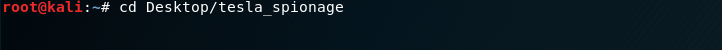
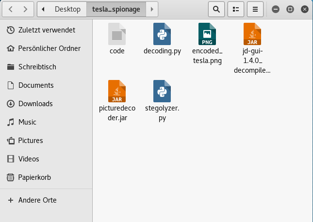
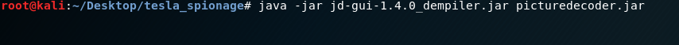
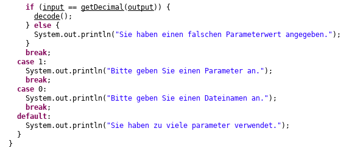
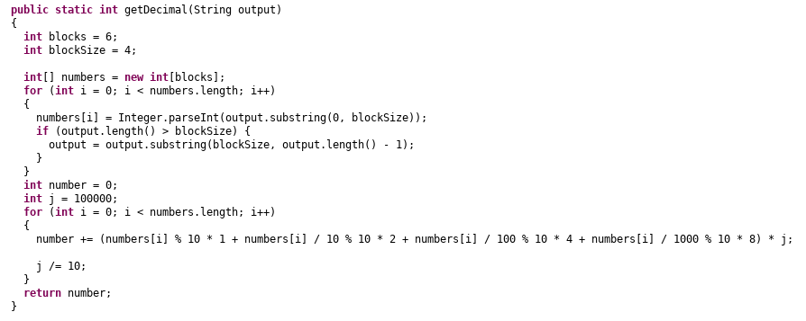
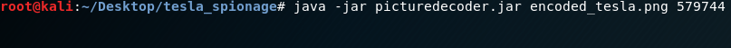
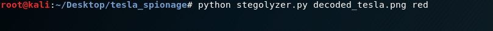
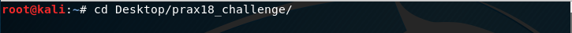

# PRAX18 Challenge


Sie sind in der IT-Abteilung bei **Volkswagen** und werden beauftragt die Kommunikation bei der Konkurrenz zu entschlüsseln.
Da ihr Unternehmen in der Vergangenheit mit dem großen Abgas-Skandal zu kämpfen hatte, beschließt die Geschäftsführung 
ihr Image wieder auf Vordermann zu bringen und möchte durch Nachhaltigkeit, Umweltbewusstsein und Transparenz glänzen.
Um es genauer zu sagen: VW setzt auf E-Mobilität.

wie schön, dass es dort schon ein Unternehmen gibt, bei dem man sich "Inspiration holen kann"...

Die Konkurrenz ist kein geringerer als **TESLA**. Der bekannteste Hersteller für Elektro-Autos.
Ihre IT-Abteilung war netterweise so lieb und hat für sie Datenpakete zwischen Ingenieuren, Auto-Designern und
Firmenchef Elon Musk höchstpersönlich abgefangen.

Jedoch kann mit dem Inhalt dieser Pakete niemand etwas anfangen, da sie verschlüsselt sind...

Da kommen sie als ehemaliger Penetration-Tester ins Spiel. Sie kennen sich hervorragend mit dem
Aufspüren von Sicherheitslücken, dem Ver- und Entschlüsseln von Dateien sowie mit dem Verändern von Porgrammen aus.
Schließlich waren Sie damals treibende Kraft bei der Software-Manipulation im ihrem Unternehmen... ;-)


## Aufbau der Challenge

Zunächst empfiehlt es sich die Challenge auf der **Kali-Linux Maschine** durchzuführen, da für Windows etwaige Python-Module besorgt werden müssen.

Sie bekommen einen Ordner mit folgenden Datein und Programmen:
- code 
- encoded_tesla.png
- jd-gui-1.4.0_decompiler.jar
- picturedecoder.jar
- stegolyzer.py
- decoding.py

Ihre Aufgabe besteht nun darin mit den gegebenen Tools so viele Informationen wie möglich zu extrahieren. Einige davon sollten Ihnen aus dem PRAX-Praktikum bekannt sein.
Ich wünsche Ihnen viel Spaß bei der Durchführung der Challenge!

## Hinweise
 
#### 1.
Sie werden nicht drumherum kommen das Programm **"picturedecoder.jar" zu decompilieren**. Nur so wissen Sie, was das Programm genau macht.
Ein Decompiler befindet sich im gegebenen Ordner. Benutzen Sie ihn.

#### 2.
Man könnte denken, dass der gegebene Code eine große Zahl repräsentiert...vielmehr ist er aufgeteilt in **vier gleichgroße Blöcke...**
Schauen sie sich den Programmcode vom Picturedecoder genau an...

#### 3.
Wenn wir etwas sehen, dann sehen wir es als großes Ganzes. Uns ist oft garnicht bewusst, dass sich das "große Ganze" aus Millionen von kleinen Dingen zusammensetzt. Manchmal hilft es mit der **Lupe genauer hinzuschauen...**


                                                           α

## Musterlösung
In der Musterlösung gebe ich eine detaillierten Beschreibung zur vollständigen Lösung meiner PRAX-Challenge.
Ich werde Schritt für Schritt aufzeigen wie und in welcher Reihenfolge man vorzugehen hat, um die benötigten Informationen zu exfiltrieren.

Als erstes kopieren Sie den Ordner "tesla-spionage" auf den **Desktop** unserer Kali-Linux Maschine
Anschließend navigieren Sie per Terminal in den Ordner mit dem folgenden Befehl



Sie sehen nun folgende in dem Ordner befindliche Dateien:



Der erste eigentliche Schritt beginnt mit dem Decompilieren des picturedecoder. Dies machen Sie über diesen Befehl



Nun öffnet sich eine grafische Oberfläche und Sie können sich den Programmcode vom pictureencoder ansehen. Werfen sie einen Blick auf die main. Sie sehen, dass die Methode "decode()" aufgerufen wird, wenn der input (zweiter Parameter) gleich dem zurückgegebenen Wert der "getDecimal()" Methode ist.



Nun hilft es einen Blick auf die "getDecimal" Methode zu werfen.



"output" übergibt hier den Code (010101111001011101000100). Dieser wird in der ersten for-Schleife in **6 gleichgroße Blöcke a 4 Ziffern** in einem Array gespeichert. In der zweiten for-Schleife geschieht die Umrechnung von Binär zu Dezimal. Allerdings wird nicht die gesamte Binärzahl als Ganzes umgerechnet, sondern Block für Block. Sprich jede 4 Bit repräsentieren eine Dezimal-Zahl.
Somit wird am Ende folgende Dezimalzahl zurückgegeben.

        // 0101 0111 1001 0111 0100 0100
        // 5    7    9    7    4    4           <--- Diese Dezimalzahl gibt die Methode zurück.
        
Damit haben wissen wir welchen (zweiten) Parameter wir verwenden müssen, um das Bild zu decodieren.
Der erste Parameter ist der Dateiname des Bildes. Also müssen Sie folgenden Befehl eingeben um das Bild zu decoden.



Im Ordner "tesla-spionage" sehen sie nun das entschlüsselte Bild mit dem Namen "decoded_tesla.png"
Jetzt wissen Sie schon mal, dass Tesla die besseren Auto-Designer hat ;)
Das Bild können sie sich über die GUI ansehen.

Der Dritte Hinweis und die Python Programme geben Aufschluss darüber, dass hier etwas **steganographisch** versteckt ist.
Benutzen sie das "stegolyzer.py" Programm um die Farbkanäle des Bildes zu untersuchen. Bedenken Sie, dass es neben (R)ot, (G)rün und (B)lau noch den **Alpha-Kanal** gibt. Dieser ist für die Transparenz zuständig.

Mit
````
python stegolyzer.py decoded_tesla.png
````
und den Parametern **red, green, blue und alpha** können sie die jeweiligen Farbkanäle untersuchen.
Hier ein Beispiel um den roten Farbkanal zu untersuchen



Allerdings werden Sie in den RBG Farbkanälen keine Auffälligkeiten feststellen. Anders sieht es im Alpha-Kanal aus.
Geben Sie


in das Terminal ein und Sie werden sehen, dass es hier gegenüber den RBG Kanälen starke Abweichungen gibt. Genau hier ist auch die steganographische Nachricht versteckt. Sie wurde im Last Significant Bit (LSB) des Alpha-Kanals versteckt.

Wenn sie nun den "decoding.py" benutzen wollen um die Nachricht zu exfiltrieren werden sie bemerken, dass dies nicht geht, da etwas im Programmcode fehlt. Öffnen sie also über die GUI "decoding.py" und lassen Sie sich den Programmcode anzeigen.

Fügen sie unter **"# TODO: Fill in here (Hier ergaenzen)"** folgenden Code ein
````
v.append(a & 1)
````
Diese Zeile befiehlt dem Programm den Alpha-Kanal zu exfiltrieren.
Im Code würde es richtig so aussehen...


Nun können wir den **stegangraphischen decoder auf das Bild anwenden** mittels folgendem Befehl
````
python decoding.py decoded_tesla.png nachricht.txt
````
In dem "tesla-spionage" Ordner wurde nun eine Textnachricht namens **"nachricht.txt" erstellt**. Sie können sich die Nachricht über die GUI anzeigen lassen und werden bemerken, dass dort eine flag zu sehen.

````
ID: bd0c07abe32eeb42963a1059e8e86ea661430f6718c8db10328b32d0801b3e09
````

Herzlichen Glückwunsch! Sie haben die Challenge erfolgreich abgeschlossen!



